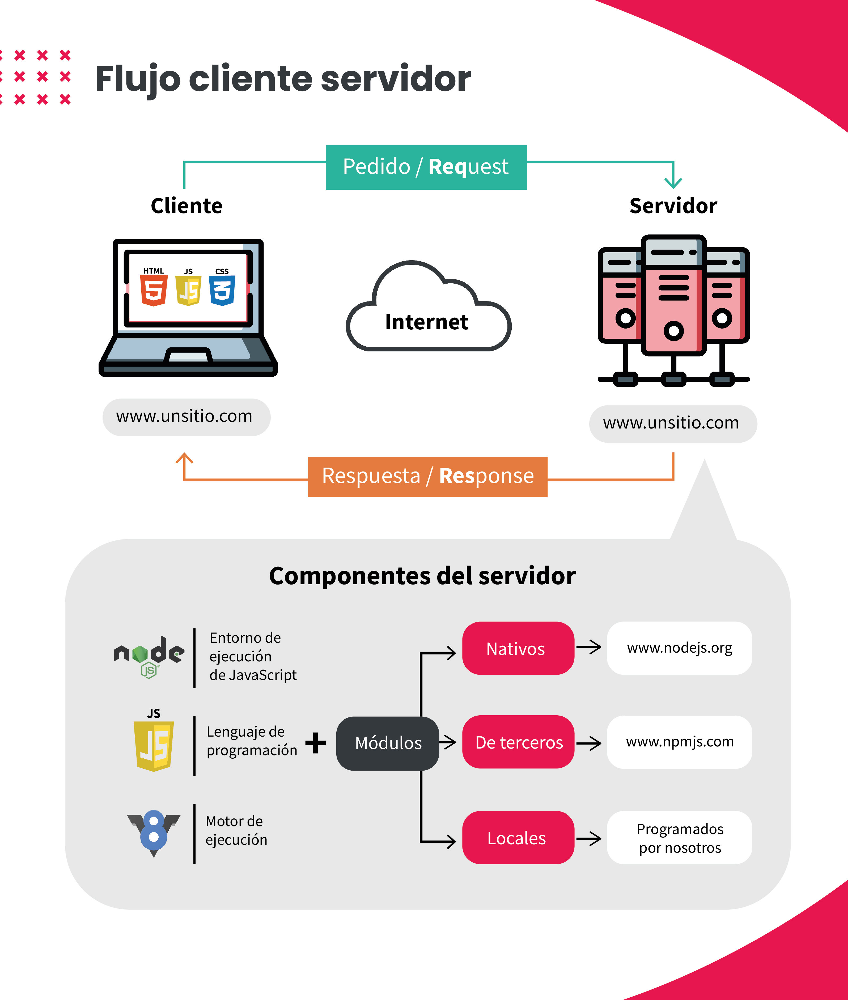

<!--MODELOS DE ESTRUCTURA-->
<!-- # Encabezado 1 -->
<!-- **Negrita** -->
<!-- *Cursiva*  -->
<!-- [Texto del enlace](URL) -->
<!--  -->
<!-- Lineas horizontales: ---  -->
<!-- Citas: > --->
<!-- `Código en línea` --->
<!-- ```Código en varias líneas``` --->

# Introducción a Servidores

## Arquitectura Cliente-Servidor

En desarrollo web, se llama **Cliente** al equipo que hace solicitudes de servicios a través de una red, y **Servidor** al dispositivo que le responde. Por tanto, la **Arquitectura Cliente-Servidor** es la red de conexiones entre clientes y servidores que existe dentro de una red, en este caso, Internet.

Del lado del cliente encontramos lenguajes como HTML, CSS y JavaScript, meintras que del lado del servidor podemos encontrar lenguajes más potentes, tales como PHP, MySQL, JavaScript, entre otros. Como vemos, es posible utilizar JavaScript para ambos lados. Esto hará más fluido el proceso de desarrollo.



## Introducción a HTTP

HTTP es el protocolo que regula las conexiones entre Cliente y Servidor. Esto lo hace a través de la **URI**, que es la suma de la **URL**, que indica donde se encuentra el archivo y cómo conectarse con él (generalmente http://), y la **URN**, que es el nombre completo del archivo.

HTTP tiene métodos que definen qué acciones se pueden hacer. Los más comunmente utilizados son:

- GET: Para solicitar datos no sensibles;
- POST: Enviar datos sensibles, es muy seguro de utilizar;
- PUT: Se usa para enviar datos y reemplazar toda la información de un recurso;
- PATCH: Se utiliza para enviar datos y reemplazar parcialmente la información del recurso;
- DELETE: Se usa para borrar toda información existente.

## Introducción a Express

Express es un framework, una infraestructura pensada para aplicaciones web y móviles hechas en Node.js, que permite aplicar multitud de funcionalidades para solucionar problemas comunes. Es uno de los frameworks más utilizados en el mundo.

Para instalarlo, debemos escribir `npm install express --save`. Luego, debemos requerir este módulo en el entry point, que generalmente es **app.js**. Esto se hace con las siguientes líneas:

1. `const express = require('express');`
2. `const app = express();`

Así, tendremos disponibles todos los métodos del métodos disponibles en Express.

## Levantar un servidor con Express

Para ello, luego de haber requerido Express en la variable app como vimos antes, deberemos usar el método **listen** dentro del entry point **app.js**, del siguiente modo:

```javascript
app.listen(3000, () => {
  console.log("Server funcionando en puerto 3000");
});
```

Aún falta cargar todo el sistema de ruteo, esta es solo la base para levantar el servidor. El servidor quedará siempre levantado mientras no cerremos la consola donde corrimos el entry point. Para cerrar el servidor, debemos hacer _Ctrl+C_. Cuando hagamos cambios en el servidor, debemos volver a correr el servidor, cerrandolo y volviéndolo a abrir.

## Introducción a Routing y Response

Esto es, básicamente, definir cómo responderá nuestro sitio web a las peticiones que haga el cliente. Esto suele verse como `app.METHOD('PATH', HANDLER);`, dónde:

- METHOD: Es el método de HTTP que utilizaremos en este caso;
- PATH : Es el nombre de la ruta al que deseamos acceder. Va entre comillas, como un string;
- HANDLER: Es una función que se ejecutará cuando la ruta sea llamada.

Ahora, particularmente hablando del HANDLER, este funciona como un callback, que recibe dos parametros: **function (req, res) {}**. El primer parámetro representa el pedido, el **request**, y el segundo representa la respuesta, el **response**. Dentro del cuerpo de la función debemos escribir la lógica que manejará la ruta. En este caso, solemos usar `res.send('Lo que queramos devolver);` dentro de la función. En código, se ve así:

```javascript
app.get("/ruta", (req, res) => {
  res.send("Esta es nuestra respuesta al pedido del Cliente");
});
```

## Enviar archivos al navegador

Para enviar archivos al navegador para que este los interprete, Express nos provee del método **sendFile('/urlArchivo')**. para que podamos definir la ruta como absoluta, debemos utilizar el módulo **path**, el cual deberemos requerir igual que Express. En código, esto se ve así:

```javascript
const path = require("path");

app.get("/ruta", (req, res) => {
  let rutaAbsoluta = path.resolve(
    __dirname,
    "/urlArchivo/nombreArchivo.formato"
  );
  res.sendFile(rutaAbsoluta);
});
```

## Estructura de archivos

La estructura de archivos que se suele utilizar para tener organizado y claro el proyecto es:

- app.js: El entry point;
- public: Archivos públicos, como css, js y media;
- views: Contiene las vistas HTML;
- routes: Contiene los archivos de rutas;
- node_modules;
- Package.json.

## Archivos estáticos

Para utilizar archivos estáticos como css, js, e incluso recursos gráficos, debemos indicarle a la variable que contenga a Express en el Entry Point que los busque en la carpeta **public**. Para ello, hacemos `app.use(express.static('public'))`.
