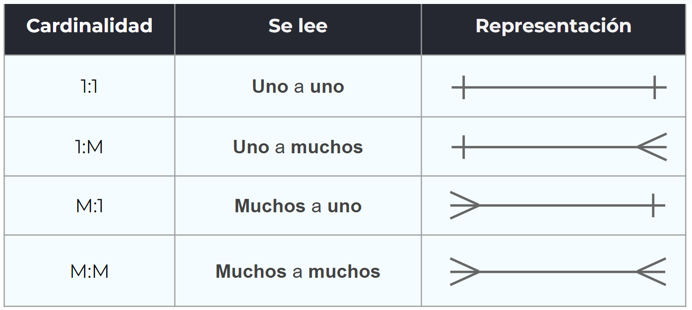

# Introducción

## Bases de datos

Una BDD es un conjunto de datos pertenencientes a un mismo contexto, organizados para un propósito específico. Es una representación de aspectos de la realidad. Estas nos sirven para:

- Almacenar datos
- Acceder a esos datos
- Manipular y combinar datos
- Analizar datos

Dentro de una BDD, los registros concretos se organizan en forma de **tablas**, que contienen **filas** y **columnas**.

## Sistemas de gestión de BDD

Un gestor de bdd es un sistema que permite **crear, gestionar y administrar** bddd, así como también crear y manejar las estructuras necesarias para el almacenamiento y búsqueda de la información del modo más eficiente posible.

## MySQL

Este sistema de administración de bdd es un software de código abierto, desarrollado por Oracle, considerada la bdd de código abierto más utilizada del mundo. Es de uso multiplataforma, y se puede trabajar con un lenguaje escrito, o bien con herramientas gráficas como **PHPMyAdmin** o **MySQL Workbench**.

# Conceptos básicos

## Tablas

Lo primero que debemos hacer es diseñar las tablas, que representan **entidades**. Estas entidades se grafican con rectángulos, indicando el nombre de las mismas, y representan elementos de la realidad, de los cuales se desea almacenar sus datos.

Estas _entidades_ tendrán **atributos**, que son las características que se van a definir de cada entidad. Así, por ejemplo, la **entidad** _Películas_ podría tener los siguientes **atributos**: título, rating, fecha_estreno, y premios.

Además, cada entidad tiene también una **Clave Primaria (PK)** que permite identificar de forma unívoca cada fila de la tabla. Siempre se indican al principio de la tabla, en la primera columna, y se indican con el agregado **(PK)**.

## Relaciones

Las **relaciones** indican cómo se vana relacionar dos tablas. Existen tres tipos de relaciones:

- Uno a uno: Cuando cada elemento de una tabla se relaciona **SOLAMENTE** con un único elemento de la otra tabla, y viceversa. Por ejemplo, la conexión entre una tabla de clientes con la dirección de entrega de pedidos que cada uno de estos haya declarado.
- Uno a muchos: Cuando cada elemento de la primer tabla puede relacionarse con varios elementos de la segunda. Por ejemplo, la relación entre un cliente, y las múltiples tarjetas de crédito que pueda tener asociadas.
- Muchos a muchos: Cuando muchos elementos de cada tabla pueden relacionarse con muchos elementos de la otra. Por ejemplo, muchos usuarios pueden comprar muchos productos distintos.

Para saber cómo se relaciona una tabla con otra, debemos plantear un ejemplo concreto de interacción entre las dos entidades que cada tabla representa. Gráficamente, se representan así:


## Tipos de datos

Los datos de cada atributo deben ser de un tipo concreto. Cuando diseñamos la tabla, debemos pernsar qué tipo de dato nos sirve para nuestro modelo. Cada tipo de dato tiene un tamaño determinado, y cuanta más precisión pongamos a este tipo de dato, más rápido y performante va a funcionar MySQL.

### Datos de tipo numérico

MySQL permite todos los tipos de datos numéricos de SQL estándar, y estos se clasifican en enteros, punto fijo, punto flotante y BIT. Entre los datos de tipo entero se encuentran: INTEGER, SMALLINT, TINYINT, MEDIUMINT, y BIGINT. La diferencia entre cada uno se encuentra en el valor máximo y mínimo permitido.

Para los **booleanos**, MySQL los guarda como ceros o unos, sin embargo, por performance, no es recomndable utilizarlos. Si se necesita guardar valores _verdaderos_ o _falsos_, se recomienda usar TINYINT y usar el **0** para **false** y el **1** para **true**.

### Datos de tipo fecha

Para almacenar fechas, podemos utilizar los siguientes tipos:

- DATE: Almacena solamente la fecha en formato YYYY-MM-DD.
- TIME: Almacena solamente la hora en formato HH:MM:SS.
- DATETIME: Almacena la fecha y hora, en formato YYYY-MM-DD HH:MM:SS.

### Datos de tipo texto

Podemos utilizar los siguientes tipos:

- CHAR(num): El número entre los parentesis indicará la cantidad exacta de caracteres que se deberán ingresar siempre.
- VARCHAR(num): El número entre parentesis indica la cantidad máxima de caracteres que podrá tener el atributo.
- TEXT: Determina un dato de tipo texto sin límite de caracteres. Se suele usar para un posteo de un blog, por ejemplo.

## Constraints

Los _contraints_ son **restricciones**, que permiten gnerar un esquema lógico de información mucho más estable y funcional a los ojos de nuestra aplicación. Los _contraints_ disponibles son:

- UNIQUE KEYS: Una unique key es una restricción que solo permite valores únicos para uno o varios campos.
- NULL / NOT NULL: NULL significa que el valor para ese campo no existe o no se conoce. NULL no es ni _vacio_ (blank) ni _cero_ (0).
- DEFAULT: Se utiliza para definir un valor por defecto para cada columna. Este valor se agrega a cada registro nuevo siempre y cuando no se especifiqye otro valor que lo sobreescriba.
- AUTO_INCREMENT: Genera un valor único y lo incrementa automáticamente con cada nuevo registro de la tabla. Se usa habitualmente para el campo ID.

## Create, Drop y Alter

Estas son directrices de SQL que nos permiten crear, eliminar y modificar tablas.

- CREATE TABLE nos permite crear una tabla completa desde cero. Por ejemplo:

```sql
CREATE TABLE ordenes (
    orden_id INT NOT NULL,
    orden_numero INT NOT NULL,
    cliente_id INT,
    PRIMARY KEY (orden_id),
    FOREIGN KEY (cliente_id) REFERENCES clientes(id)
);
```

## Foreign Keys
